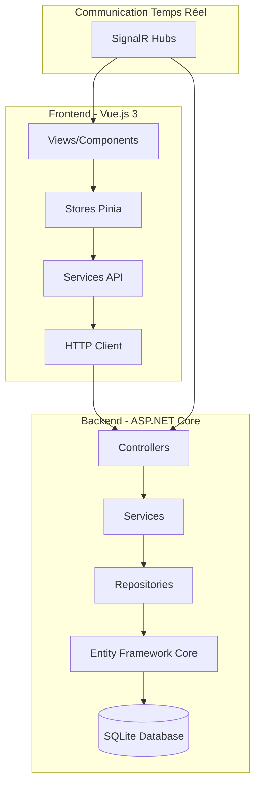
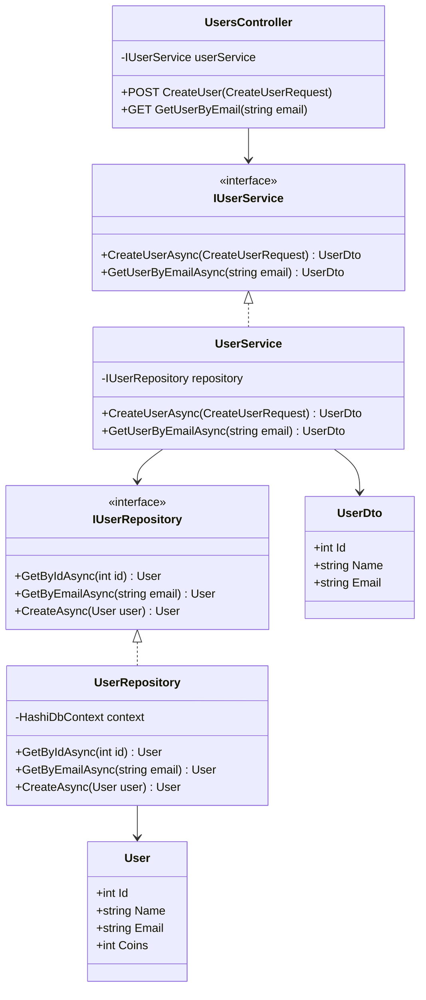
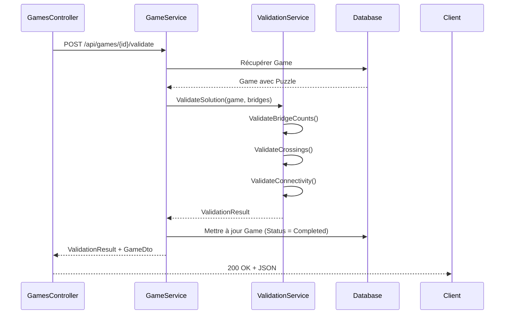
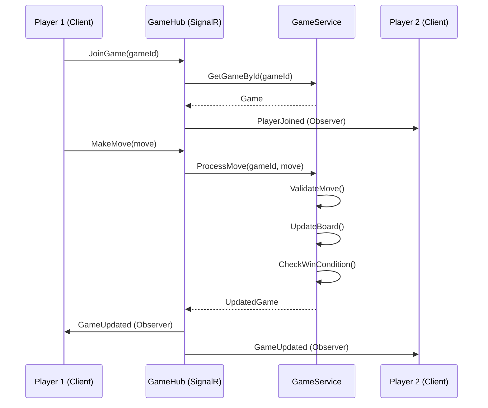
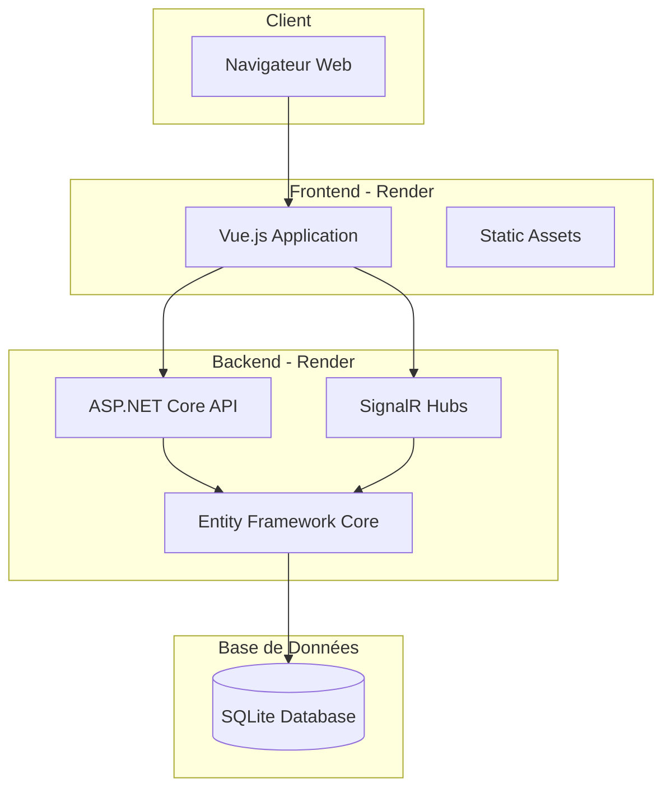
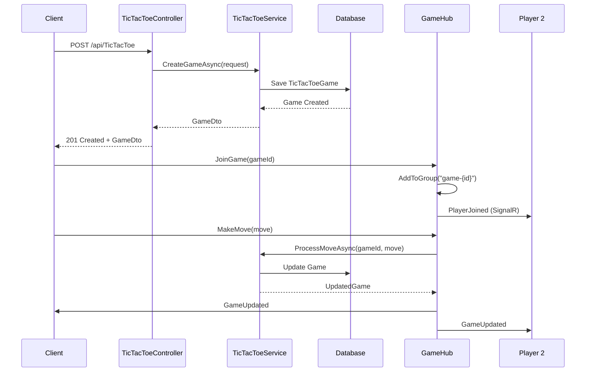
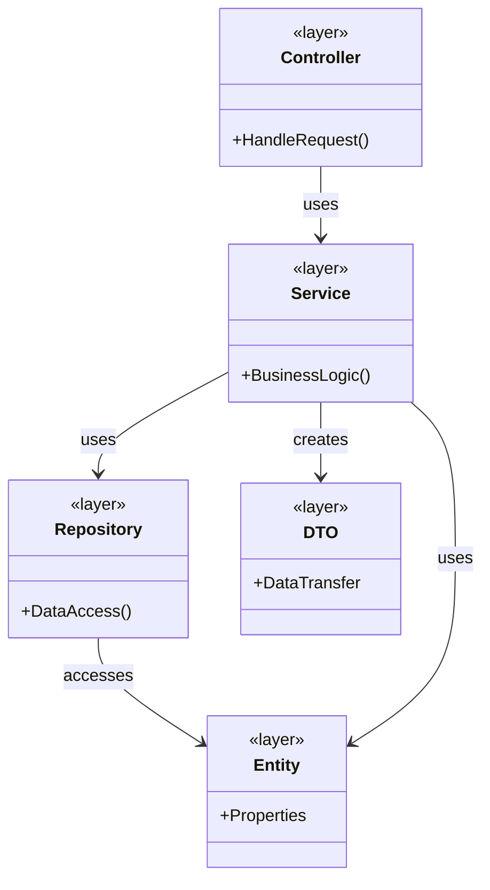

# Documentation Architecturale - Principes SOLID et Patterns GoF

## Table des Matières

1. [Introduction](#introduction)
2. [Vue d'Ensemble de l'Application](#vue-densemble-de-lapplication)
3. [Architecture Générale](#architecture-générale)
4. [Fonctionnalités et Analyse Architecturale](#fonctionnalités-et-analyse-architecturale)
   - [1. Gestion des Utilisateurs et Authentification](#1-gestion-des-utilisateurs-et-authentification)
   - [2. Gestion des Sessions](#2-gestion-des-sessions)
   - [3. Jeu Hashi (Puzzle des Ponts)](#3-jeu-hashi-puzzle-des-ponts)
   - [4. Jeux Multijoueurs](#4-jeux-multijoueurs)
   - [5. Système de Magasin et Économie](#5-système-de-magasin-et-économie)
   - [6. Système Social](#6-système-social)
   - [7. Communauté et Publications](#7-communauté-et-publications)
   - [8. Système de Notifications](#8-système-de-notifications)
   - [9. Statistiques et Classement](#9-statistiques-et-classement)
   - [10. Tournois](#10-tournois)
   - [11. Mode Aventure](#11-mode-aventure)
5. [Diagrammes d'Architecture](#diagrammes-darchitecture)
6. [Conclusion](#conclusion)

---

## Introduction

Ce document présente une analyse architecturale complète de l'application **BabaGame** (anciennement Hashi), une plateforme de jeux multijoueurs avec système économique et social. L'analyse se concentre sur l'identification des principes SOLID et des patterns de conception GoF (Gang of Four) appliqués dans chaque fonctionnalité.

### Technologies Utilisées

- **Backend**: ASP.NET Core 8.0, Entity Framework Core, SQLite
- **Frontend**: Vue.js 3.5, TypeScript, Pinia, Vue Router
- **Communication**: REST API, SignalR (WebSockets)
- **Architecture**: Architecture en couches (Layered Architecture)

---

## Vue d'Ensemble de l'Application

L'application est une plateforme de jeux multijoueurs comprenant :

- **Jeux Solo**: Hashi (puzzle des ponts), Mode Aventure
- **Jeux Multijoueurs**: Tic-Tac-Toe, Connect Four, Rock Paper Scissors
- **Système Social**: Amis, Chat, Communauté
- **Système Économique**: Monnaie virtuelle (Babayuni), Magasin, Items
- **Compétition**: Tournois, Classements, Statistiques

---

## Architecture Générale

### Diagramme d'Architecture en Couches



### Principes SOLID Appliqués Globalement

- **S (Single Responsibility)**: Chaque service, repository et contrôleur a une responsabilité unique
- **O (Open/Closed)**: Utilisation d'interfaces permettant l'extension sans modification
- **L (Liskov Substitution)**: Les implémentations respectent leurs interfaces contractuelles
- **I (Interface Segregation)**: Interfaces spécifiques (IUserService, IGameService, etc.)
- **D (Dependency Inversion)**: Injection de dépendances via interfaces

---

## Fonctionnalités et Analyse Architecturale

### 1. Gestion des Utilisateurs et Authentification

#### Description
Gestion complète du cycle de vie des utilisateurs : création, authentification, profil, et gestion des données utilisateur.

#### Composants Backend
- **Controller**: `UsersController.cs`
- **Service**: `UserService.cs` (implémente `IUserService`)
- **Repository**: `UserRepository.cs` (implémente `IUserRepository`)
- **Modèle**: `User.cs`

#### Principes SOLID Appliqués

**Single Responsibility Principle (SRP)**
- `UserService`: Responsable uniquement de la logique métier utilisateur
- `UserRepository`: Responsable uniquement de l'accès aux données utilisateur
- `UsersController`: Responsable uniquement de l'exposition HTTP

**Open/Closed Principle (OCP)**
- Interface `IUserService` permet d'ajouter de nouvelles implémentations sans modifier le code existant
- Extension possible via héritage ou composition

**Liskov Substitution Principle (LSP)**
- Toute implémentation de `IUserService` peut remplacer `UserService` sans casser le système

**Interface Segregation Principle (ISP)**
- `IUserService` contient uniquement les méthodes nécessaires à la gestion utilisateur
- Pas de dépendance vers d'autres domaines (jeux, items, etc.)

**Dependency Inversion Principle (DIP)**
- `UsersController` dépend de `IUserService`, pas de `UserService`
- `UserService` dépend de `IUserRepository`, pas de `UserRepository`
- Injection via `Program.cs` : `builder.Services.AddScoped<IUserService, UserService>()`

#### Patterns GoF Appliqués

**Pattern Repository**
```csharp
// Interface
public interface IUserRepository
{
    Task<User?> GetByIdAsync(int id);
    Task<User?> GetByEmailAsync(string email);
    Task<User> CreateAsync(User user);
    Task<User> UpdateAsync(User user);
}

// Implémentation
public class UserRepository : IUserRepository
{
    private readonly HashiDbContext _context;
    // Implémentation...
}
```
- **Type**: Pattern Créationnel/Structurel
- **But**: Encapsuler l'accès aux données et fournir une interface uniforme
- **Bénéfice**: Facilite les tests, permet de changer de source de données

**Pattern Service Layer / Facade**
```csharp
public interface IUserService
{
    Task<UserDto> CreateUserAsync(CreateUserRequest request);
    Task<UserDto?> GetUserByEmailAsync(string email);
    Task<UserDto> UpdateUserAsync(int userId, UpdateUserRequest request);
}
```
- **Type**: Pattern Structurel
- **But**: Fournir une interface simplifiée à un sous-système complexe
- **Bénéfice**: Découple les contrôleurs de la logique métier

**Pattern DTO (Data Transfer Object)**
```csharp
public class UserDto
{
    public int Id { get; set; }
    public string Name { get; set; }
    public string Email { get; set; }
    // Pas de données sensibles
}
```
- **Type**: Pattern Structurel
- **But**: Transférer des données entre couches sans exposer les entités
- **Bénéfice**: Sécurité, contrôle des données exposées

#### Diagramme de Classes



---

### 2. Gestion des Sessions

#### Description
Gestion des sessions utilisateur pour maintenir l'état de connexion et associer les parties aux utilisateurs.

#### Composants Backend
- **Controller**: `SessionsController.cs`
- **Service**: `SessionService.cs` (implémente `ISessionService`)
- **Modèle**: `Session.cs`

#### Principes SOLID Appliqués

**Single Responsibility Principle (SRP)**
- `SessionService`: Gestion exclusive de la logique des sessions
- Validation, expiration, création automatique

**Dependency Inversion Principle (DIP)**
- `SessionService` dépend de `ISessionRepository` (interface)
- Injection de dépendances dans `Program.cs`

#### Patterns GoF Appliqués

**Pattern Factory (implicite)**
```csharp
public async Task<Session> CreateSessionAsync(int userId)
{
    // Création d'une nouvelle session avec valeurs par défaut
    var session = new Session
    {
        UserId = userId,
        CreatedAt = DateTime.UtcNow,
        ExpiresAt = DateTime.UtcNow.AddDays(7),
        IsActive = true
    };
    // ...
}
```
- **Type**: Pattern Créationnel
- **But**: Centraliser la création d'objets complexes
- **Bénéfice**: Contrôle de la création, valeurs par défaut cohérentes

**Pattern State (implicite)**
- `Session.IsActive` et `Session.ExpiresAt` représentent l'état de la session
- Transitions d'état gérées par `SessionService`

---

### 3. Jeu Hashi (Puzzle des Ponts)

#### Description
Jeu de puzzle logique où le joueur doit relier des îles avec des ponts en respectant des contraintes.

#### Composants Backend
- **Controllers**: `PuzzlesController.cs`, `GamesController.cs`
- **Services**: `PuzzleService.cs`, `GameService.cs`, `ValidationService.cs`
- **Modèles**: `Puzzle.cs`, `Island.cs`, `Bridge.cs`, `Game.cs`

#### Principes SOLID Appliqués

**Single Responsibility Principle (SRP)**
- `PuzzleService`: Gestion des puzzles (génération, récupération)
- `GameService`: Gestion du cycle de vie des parties
- `ValidationService`: Validation exclusive des solutions

**Open/Closed Principle (OCP)**
- Interface `IValidationService` permet d'ajouter de nouvelles stratégies de validation
- Extension possible pour différents types de puzzles

**Dependency Inversion Principle (DIP)**
- `GamesController` dépend de `IGameService`, `IValidationService`, `IPuzzleService`
- Pas de dépendance directe vers les implémentations

#### Patterns GoF Appliqués

**Pattern Strategy**
```csharp
public interface IValidationService
{
    ValidationResult ValidateSolution(Game game, List<BridgeDto> bridges);
}

public class ValidationService : IValidationService
{
    public ValidationResult ValidateSolution(Game game, List<BridgeDto> bridges)
    {
        // Stratégie de validation : vérification des règles
        var errors = new List<string>();
        
        // Vérifier nombre de ponts par île
        ValidateBridgeCounts(game.Puzzle.Islands, bridges, errors);
        
        // Vérifier croisements
        ValidateCrossings(bridges, errors);
        
        // Vérifier connectivité
        ValidateConnectivity(game.Puzzle.Islands, bridges, errors);
        
        return new ValidationResult
        {
            IsValid = errors.Count == 0,
            Errors = errors
        };
    }
}
```
- **Type**: Pattern Comportemental
- **But**: Encapsuler des algorithmes interchangeables
- **Bénéfice**: Facilite l'ajout de nouvelles stratégies de validation

**Pattern Template Method (implicite)**
- Le processus de validation suit un template : vérifier règles → vérifier croisements → vérifier connectivité
- Chaque étape peut être surchargée si nécessaire

**Pattern Builder (implicite)**
```csharp
// Génération de puzzle avec construction progressive
public async Task<Puzzle> GeneratePuzzleAsync(GeneratePuzzleRequest request)
{
    // Étape 1: Créer les îles
    var islands = GenerateIslands(request.Width, request.Height);
    
    // Étape 2: Calculer les ponts nécessaires
    var bridges = CalculateRequiredBridges(islands);
    
    // Étape 3: Créer le puzzle
    var puzzle = new Puzzle
    {
        Width = request.Width,
        Height = request.Height,
        Difficulty = request.Difficulty,
        Islands = islands
    };
    
    return puzzle;
}
```
- **Type**: Pattern Créationnel
- **But**: Construire des objets complexes étape par étape
- **Bénéfice**: Contrôle du processus de construction

#### Diagramme de Séquence - Validation d'une Partie



---

### 4. Jeux Multijoueurs

#### Description
Système de jeux multijoueurs en temps réel : Tic-Tac-Toe, Connect Four, Rock Paper Scissors.

#### Composants Backend
- **Controllers**: `TicTacToeController.cs`, `ConnectFourController.cs`, `RockPaperScissorsController.cs`
- **Services**: `TicTacToeService.cs`, `ConnectFourService.cs`, `RockPaperScissorsService.cs`
- **Hubs SignalR**: `GameHub.cs` (communication temps réel)
- **Modèles**: `TicTacToeGame.cs`, `ConnectFourGame.cs`, `RockPaperScissorsGame.cs`

#### Principes SOLID Appliqués

**Single Responsibility Principle (SRP)**
- Chaque service de jeu gère uniquement son type de jeu
- `TicTacToeService`: Logique exclusive du Tic-Tac-Toe
- `ConnectFourService`: Logique exclusive du Connect Four
- `RockPaperScissorsService`: Logique exclusive du Rock Paper Scissors

**Open/Closed Principle (OCP)**
- Interface commune possible pour les jeux multijoueurs
- Extension pour nouveaux jeux sans modifier le code existant

**Liskov Substitution Principle (LSP)**
- Si une interface `IGameService<T>` existait, chaque implémentation serait substituable

**Interface Segregation Principle (ISP)**
- Interfaces séparées par type de jeu
- Pas d'interface monolithique contenant toutes les méthodes

**Dependency Inversion Principle (DIP)**
- Contrôleurs dépendent d'interfaces (`ITicTacToeService`, etc.)
- Injection de dépendances

#### Patterns GoF Appliqués

**Pattern Observer (via SignalR)**
```csharp
public class GameHub : Hub
{
    public async Task JoinGame(int gameId, int sessionId)
    {
        await Groups.AddToGroupAsync(Context.ConnectionId, $"game-{gameId}");
        // Notifier les autres joueurs
        await Clients.Group($"game-{gameId}").SendAsync("PlayerJoined", sessionId);
    }
    
    public async Task MakeMove(int gameId, MoveDto move)
    {
        // Traiter le coup
        var updatedGame = await _gameService.ProcessMoveAsync(gameId, move);
        
        // Notifier tous les observateurs (Observer Pattern)
        await Clients.Group($"game-{gameId}").SendAsync("GameUpdated", updatedGame);
    }
}
```
- **Type**: Pattern Comportemental
- **But**: Notifier automatiquement les observateurs des changements d'état
- **Bénéfice**: Découplage entre sujet (GameHub) et observateurs (clients)

**Pattern State**
```csharp
public enum TicTacToeGameStatus
{
    WaitingForPlayer = 1,
    InProgress = 2,
    Completed = 3,
    Abandoned = 4
}

// Le statut détermine les actions possibles
public async Task<ActionResult> MakeMove(int gameId, MakeMoveRequest request)
{
    var game = await _service.GetGameByIdAsync(gameId);
    
    if (game.Status != TicTacToeGameStatus.InProgress)
    {
        return BadRequest("La partie n'est pas en cours");
    }
    
    // Traiter le coup uniquement si l'état le permet
    // ...
}
```
- **Type**: Pattern Comportemental
- **But**: Permettre à un objet de changer son comportement selon son état
- **Bénéfice**: Évite les conditions complexes, facilite l'ajout d'états

**Pattern Command (implicite)**
```csharp
// Chaque action (MakeMove, JoinGame, Abandon) est une commande
public async Task<ConnectFourGame> MakeMoveAsync(int gameId, PlayMoveRequest request)
{
    // Commande encapsulée dans une méthode
    // Peut être annulée, loggée, mise en file d'attente
}
```
- **Type**: Pattern Comportemental
- **But**: Encapsuler une requête comme objet
- **Bénéfice**: Paramétrage, file d'attente, annulation possible

**Pattern Factory (implicite)**
```csharp
public async Task<TicTacToeGame> CreateGameAsync(CreateTicTacToeGameRequest request)
{
    var game = new TicTacToeGame
    {
        Player1SessionId = request.Player1SessionId,
        GameMode = request.GameMode,
        BoardJson = "[\"\",\"\",\"\",\"\",\"\",\"\",\"\",\"\",\"\"]",
        CurrentPlayer = 1,
        Status = TicTacToeGameStatus.WaitingForPlayer
    };
    // ...
}
```
- **Type**: Pattern Créationnel
- **But**: Centraliser la création d'objets complexes
- **Bénéfice**: Valeurs par défaut cohérentes, logique de création centralisée

#### Diagramme de Communication Temps Réel



---

### 5. Système de Magasin et Économie

#### Description
Système économique avec monnaie virtuelle (Babayuni), magasin d'items, et gestion des possessions utilisateur.

#### Composants Backend
- **Controller**: `ShopController.cs`
- **Service**: `ItemService.cs` (implémente `IItemService`)
- **Modèles**: `Item.cs`, `UserItem.cs`
- **Repository**: Accès via `HashiDbContext`

#### Principes SOLID Appliqués

**Single Responsibility Principle (SRP)**
- `ItemService`: Gestion exclusive des items et transactions
- `ShopController`: Exposition HTTP uniquement
- Séparation claire entre items et utilisateurs

**Open/Closed Principle (OCP)**
- Interface `IItemService` permet d'ajouter de nouveaux types d'items
- Extension possible sans modification du code existant

**Dependency Inversion Principle (DIP)**
- `ShopController` dépend de `IItemService`
- Injection de dépendances

#### Patterns GoF Appliqués

**Pattern Facade**
```csharp
public interface IItemService
{
    Task<List<ItemDto>> GetAllItemsAsync();
    Task<ItemDto> GetItemByIdAsync(int itemId);
    Task<UserItemDto> PurchaseItemAsync(int userId, int itemId);
    Task<List<UserItemDto>> GetUserItemsAsync(int userId);
    Task<UserItemDto> EquipItemAsync(int userId, int userItemId, ItemType itemType);
}
```
- **Type**: Pattern Structurel
- **But**: Fournir une interface simplifiée à un sous-système complexe
- **Bénéfice**: Masque la complexité des transactions, vérifications de solde, etc.

**Pattern Strategy (implicite)**
- Différentes stratégies de calcul de prix selon le type d'item
- Stratégies d'équipement différentes selon le type (Avatar, Thème, Décoration)

**Pattern Transaction Script (implicite)**
```csharp
public async Task<UserItemDto> PurchaseItemAsync(int userId, int itemId)
{
    // Script de transaction : étapes séquentielles
    var user = await _context.Users.FindAsync(userId);
    var item = await _context.Items.FindAsync(itemId);
    
    if (user.Coins < item.Price)
        throw new InvalidOperationException("Solde insuffisant");
    
    user.Coins -= item.Price;
    
    var userItem = new UserItem
    {
        UserId = userId,
        ItemId = itemId,
        PurchasedAt = DateTime.UtcNow
    };
    
    _context.UserItems.Add(userItem);
    await _context.SaveChangesAsync();
    
    return ConvertToDto(userItem);
}
```
- **Type**: Pattern Organisationnel (Martin Fowler)
- **But**: Organiser la logique métier en procédures
- **Bénéfice**: Simplicité pour des transactions linéaires

---

### 6. Système Social

#### Description
Gestion des amitiés, demandes d'amis, et chat en temps réel entre utilisateurs.

#### Composants Backend
- **Controller**: `FriendsController.cs`, `ChatController.cs`
- **Services**: `FriendshipService.cs`, `ChatService.cs`
- **Modèles**: `Friendship.cs`, `FriendRequest.cs`, `ChatMessage.cs`
- **Hub SignalR**: `ChatHub.cs` (chat temps réel)

#### Principes SOLID Appliqués

**Single Responsibility Principle (SRP)**
- `FriendshipService`: Gestion exclusive des relations d'amitié
- `ChatService`: Gestion exclusive des messages
- Séparation claire des responsabilités

**Dependency Inversion Principle (DIP)**
- Contrôleurs dépendent d'interfaces (`IFriendshipService`, `IChatService`)

#### Patterns GoF Appliqués

**Pattern Observer (via SignalR)**
```csharp
public class ChatHub : Hub
{
    public async Task SendMessage(int recipientId, string message)
    {
        // Sauvegarder le message
        var chatMessage = await _chatService.SendMessageAsync(
            Context.UserId, recipientId, message);
        
        // Notifier le destinataire (Observer Pattern)
        await Clients.User(recipientId.ToString())
            .SendAsync("ReceiveMessage", chatMessage);
    }
}
```
- **Type**: Pattern Comportemental
- **But**: Notifier automatiquement les utilisateurs des nouveaux messages
- **Bénéfice**: Communication temps réel découplée

**Pattern Mediator (implicite)**
- `ChatService` agit comme médiateur entre les utilisateurs
- Centralise la logique de routage des messages

**Pattern State**
```csharp
public enum FriendRequestStatus
{
    Pending = 1,
    Accepted = 2,
    Rejected = 3,
    Cancelled = 4
}
```
- **Type**: Pattern Comportemental
- **But**: Gérer les transitions d'état des demandes d'amis
- **Bénéfice**: Évite les états invalides

---

### 7. Communauté et Publications

#### Description
Système de publications communautaires avec likes, commentaires, et partage de contenu.

#### Composants Backend
- **Controller**: `CommunityController.cs`
- **Service**: `CommunityService.cs` (implémente `ICommunityService`)
- **Modèles**: `CommunityPost.cs`, `CommunityPostLike.cs`, `CommunityPostComment.cs`

#### Principes SOLID Appliqués

**Single Responsibility Principle (SRP)**
- `CommunityService`: Gestion exclusive des publications
- Séparation entre posts, likes, et commentaires

**Open/Closed Principle (OCP)**
- Interface `ICommunityService` permet d'ajouter de nouvelles fonctionnalités
- Extension possible pour nouveaux types de contenu

#### Patterns GoF Appliqués

**Pattern Composite**
```csharp
// Structure hiérarchique : Post -> Comments
public class CommunityPost
{
    public int Id { get; set; }
    public string Content { get; set; }
    public List<CommunityPostComment> Comments { get; set; }
    public List<CommunityPostLike> Likes { get; set; }
}

public class CommunityPostComment
{
    public int Id { get; set; }
    public int PostId { get; set; }
    public string Content { get; set; }
}
```
- **Type**: Pattern Structurel
- **But**: Composer des objets en structures arborescentes
- **Bénéfice**: Traitement uniforme des posts et commentaires

**Pattern Observer (implicite)**
- Notification des utilisateurs lors de nouveaux likes/commentaires
- Via SignalR ou système de notifications

---

### 8. Système de Notifications

#### Description
Système centralisé de notifications pour les événements utilisateur (invitations, messages, tournois, etc.).

#### Composants Backend
- **Controller**: `NotificationsController.cs`
- **Service**: `NotificationService.cs` (implémente `INotificationService`)
- **Modèle**: `Notification.cs`
- **Hub SignalR**: Notification en temps réel

#### Principes SOLID Appliqués

**Single Responsibility Principle (SRP)**
- `NotificationService`: Gestion exclusive des notifications
- Création, récupération, marquage comme lu

**Open/Closed Principle (OCP)**
- Interface `INotificationService` permet d'ajouter de nouveaux types de notifications
- Extension sans modification du code existant

#### Patterns GoF Appliqués

**Pattern Observer**
```csharp
// Les utilisateurs s'abonnent aux notifications
public class NotificationHub : Hub
{
    public async Task SubscribeToNotifications(int userId)
    {
        await Groups.AddToGroupAsync(
            Context.ConnectionId, 
            $"user-{userId}");
    }
}

// Service notifie via SignalR
public async Task CreateNotificationAsync(Notification notification)
{
    _context.Notifications.Add(notification);
    await _context.SaveChangesAsync();
    
    // Notifier l'utilisateur (Observer Pattern)
    await _hubContext.Clients
        .Group($"user-{notification.UserId}")
        .SendAsync("NewNotification", notification);
}
```
- **Type**: Pattern Comportemental
- **But**: Notifier automatiquement les observateurs
- **Bénéfice**: Découplage entre émetteur et récepteurs

**Pattern Factory (implicite)**
- Création de différents types de notifications (Invitation, Message, Tournament, etc.)
- Factory centralisée pour la création

---

### 9. Statistiques et Classement

#### Description
Calcul et affichage des statistiques utilisateur et classement global des joueurs.

#### Composants Backend
- **Controller**: `StatsController.cs`
- **Service**: `StatsService.cs` (implémente `IStatsService`)
- **DTOs**: `UserStatsDto.cs`, `LeaderboardEntryDto.cs`

#### Principes SOLID Appliqués

**Single Responsibility Principle (SRP)**
- `StatsService`: Calcul exclusif des statistiques
- Séparation entre calcul et exposition

**Dependency Inversion Principle (DIP)**
- `StatsController` dépend de `IStatsService`

#### Patterns GoF Appliqués

**Pattern Facade**
```csharp
public interface IStatsService
{
    Task<UserStatsDto> GetUserStatsAsync(int userId);
    Task<List<LeaderboardEntryDto>> GetLeaderboardAsync(int limit);
}
```
- **Type**: Pattern Structurel
- **But**: Simplifier l'accès aux statistiques complexes
- **Bénéfice**: Masque la complexité des calculs agrégés

**Pattern Strategy (implicite)**
- Différentes stratégies de calcul selon le type de jeu
- Extension possible pour nouveaux jeux

---

### 10. Tournois

#### Description
Système de tournois avec brackets, matchs, et récompenses.

#### Composants Backend
- **Controller**: `TournamentsController.cs`
- **Service**: `TournamentService.cs` (implémente `ITournamentService`)
- **Modèles**: `Tournament.cs`, `TournamentMatch.cs`, `TournamentParticipant.cs`

#### Principes SOLID Appliqués

**Single Responsibility Principle (SRP)**
- `TournamentService`: Gestion exclusive des tournois
- Logique de brackets, matchs, progression

**Open/Closed Principle (OCP)**
- Interface `ITournamentService` permet d'ajouter de nouveaux formats de tournois
- Extension possible (round-robin, élimination simple, etc.)

#### Patterns GoF Appliqués

**Pattern Composite**
```csharp
// Structure hiérarchique : Tournament -> Matches -> Participants
public class Tournament
{
    public int Id { get; set; }
    public List<TournamentMatch> Matches { get; set; }
    public List<TournamentParticipant> Participants { get; set; }
}
```
- **Type**: Pattern Structurel
- **But**: Représenter des structures hiérarchiques
- **Bénéfice**: Traitement uniforme des tournois et matchs

**Pattern State**
```csharp
public enum TournamentStatus
{
    Registration = 1,
    InProgress = 2,
    Completed = 3,
    Cancelled = 4
}
```
- **Type**: Pattern Comportemental
- **But**: Gérer les transitions d'état du tournoi
- **Bénéfice**: Contrôle des actions selon l'état

**Pattern Strategy (implicite)**
- Différentes stratégies de génération de brackets
- Extension possible pour nouveaux formats

---

### 11. Mode Aventure

#### Description
Mode aventure avec mini-jeux (Memory, Code, Match, Reflex, Sequence) et progression.

#### Composants Backend
- **Controller**: `AdventureController.cs`
- **Service**: `AdventureService.cs` (implémente `IAdventureService`)
- **Modèle**: `AdventureGame.cs`

#### Principes SOLID Appliqués

**Single Responsibility Principle (SRP)**
- `AdventureService`: Gestion exclusive du mode aventure
- Chaque mini-jeu peut avoir sa propre logique

**Open/Closed Principle (OCP)**
- Interface `IAdventureService` permet d'ajouter de nouveaux mini-jeux
- Extension sans modification

#### Patterns GoF Appliqués

**Pattern Strategy**
```csharp
// Différentes stratégies pour chaque mini-jeu
public enum AdventureGameType
{
    Memory = 1,
    Code = 2,
    Match = 3,
    Reflex = 4,
    Sequence = 5
}

// Chaque type peut avoir sa propre stratégie de validation/scoring
```
- **Type**: Pattern Comportemental
- **But**: Encapsuler les algorithmes de chaque mini-jeu
- **Bénéfice**: Facilite l'ajout de nouveaux mini-jeux

**Pattern Template Method (implicite)**
- Template commun pour le cycle de vie des mini-jeux
- Étapes : Start → Play → Validate → Complete

---

## Diagrammes d'Architecture

### Diagramme de Déploiement



### Diagramme de Séquence - Création d'une Partie Multijoueur



### Diagramme de Classes - Architecture en Couches



---

## Conclusion

### Résumé des Principes SOLID

L'application respecte globalement les principes SOLID :

- **Single Responsibility**: Chaque classe a une responsabilité unique et bien définie
- **Open/Closed**: Utilisation systématique d'interfaces permettant l'extension
- **Liskov Substitution**: Toutes les implémentations respectent leurs contrats d'interface
- **Interface Segregation**: Interfaces spécifiques et ciblées
- **Dependency Inversion**: Injection de dépendances via interfaces

### Résumé des Patterns GoF

Les patterns GoF les plus utilisés sont :

1. **Repository Pattern**: Accès aux données encapsulé
2. **Service Layer / Facade**: Interface simplifiée aux sous-systèmes
3. **Observer**: Communication temps réel via SignalR
4. **Strategy**: Algorithmes interchangeables (validation, scoring)
5. **Factory**: Création centralisée d'objets complexes
6. **State**: Gestion des états des entités
7. **DTO**: Transfert de données entre couches
8. **Composite**: Structures hiérarchiques (posts/comments, tournaments/matches)

### Bénéfices de l'Architecture

- **Maintenabilité**: Code organisé et séparé par responsabilités
- **Testabilité**: Interfaces facilitent les tests unitaires
- **Extensibilité**: Ajout de nouvelles fonctionnalités sans modification du code existant
- **Scalabilité**: Architecture en couches permet la montée en charge
- **Réutilisabilité**: Services et repositories réutilisables

### Recommandations

1. **Tests Unitaires**: Ajouter des tests pour chaque service et repository
2. **Documentation API**: Compléter la documentation Swagger
3. **Gestion d'Erreurs**: Standardiser la gestion des erreurs avec des exceptions personnalisées
4. **Logging**: Améliorer le logging pour le debugging et le monitoring
5. **Caching**: Implémenter un système de cache pour les données fréquemment accédées

---

**Document généré le**: 2025-01-15  
**Version de l'application**: 1.0.0  
**Auteur**: Équipe de Développement BabaGame

