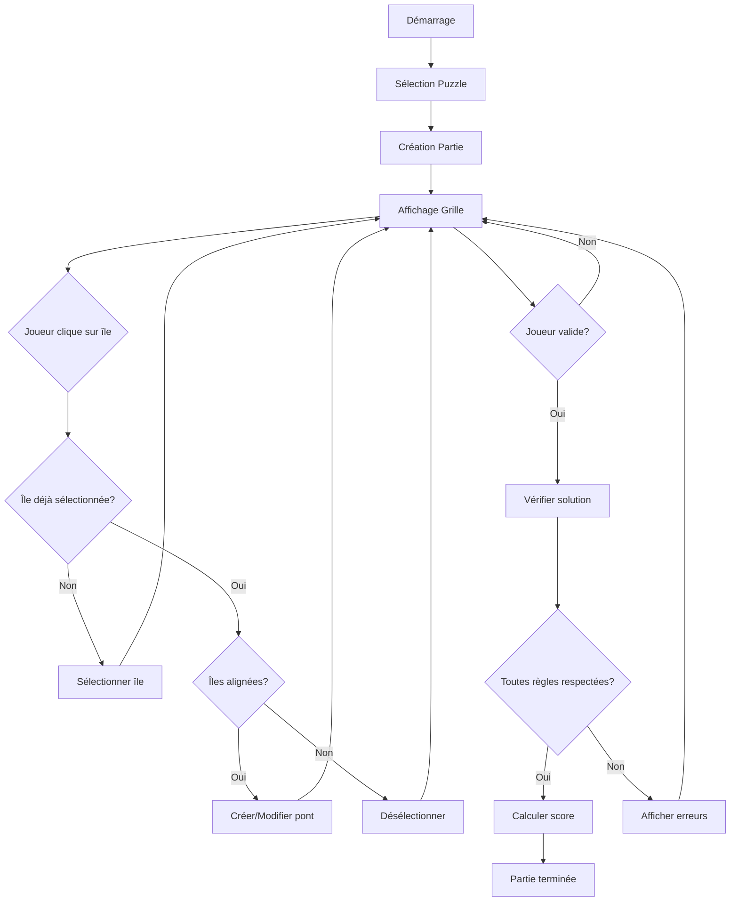
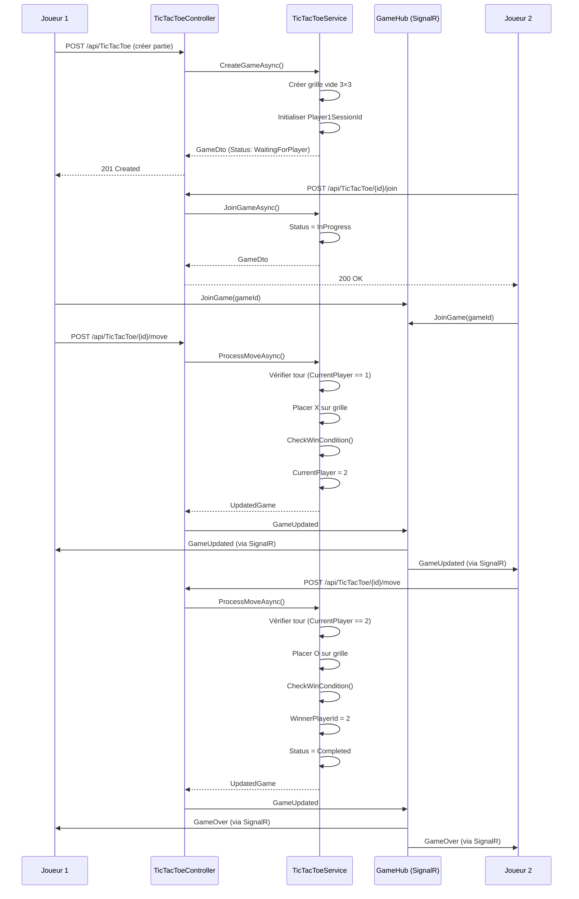
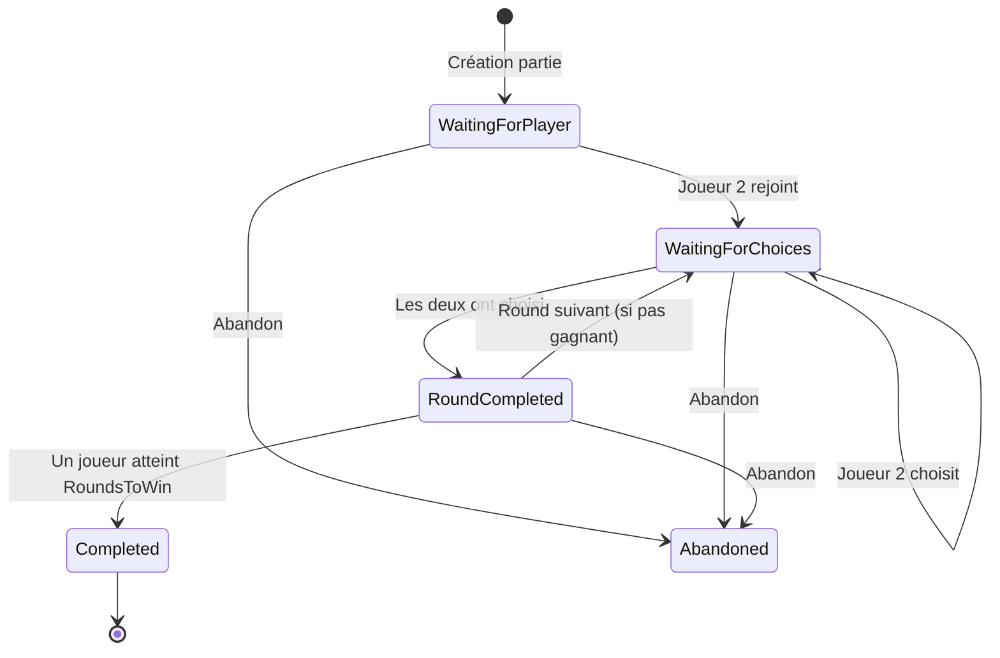

# Documentation du Fonctionnement des Jeux

## Table des Matières

1. [Introduction](#introduction)
2. [Jeux Solo](#jeux-solo)
   - [1. Hashi (Puzzle des Ponts)](#1-hashi-puzzle-des-ponts)
   - [2. Mode Aventure](#2-mode-aventure)
     - [2.1. Jeu de Mémoire](#21-jeu-de-mémoire)
     - [2.2. Déchiffrage de Code](#22-déchiffrage-de-code)
     - [2.3. Jeu de Correspondance](#23-jeu-de-correspondance)
     - [2.4. Jeu de Réflexe](#24-jeu-de-réflexe)
     - [2.5. Jeu de Séquence](#25-jeu-de-séquence)
3. [Jeux Multijoueurs](#jeux-multijoueurs)
   - [3.1. Tic-Tac-Toe (Morpion)](#31-tic-tac-toe-morpion)
   - [3.2. Connect Four (Puissance 4)](#32-connect-four-puissance-4)
   - [3.3. Rock Paper Scissors (Pierre-Papier-Ciseaux)](#33-rock-paper-scissors-pierre-papier-ciseaux)

---

## Introduction

Cette documentation décrit en détail le fonctionnement de chaque jeu disponible sur la plateforme **BabaGame**. Pour chaque jeu, sont expliquées les règles, les mécaniques de jeu et le processus de déroulement d'une partie.

---

## Jeux Solo

### 1. Hashi (Puzzle des Ponts)

#### Description Générale

Hashi (橋をかけろ, Hashiwokakero) est un jeu de puzzle logique japonais où le joueur doit relier toutes les îles d'une grille avec des ponts en respectant des contraintes précises.

#### Objectif du Jeu

Relier toutes les îles avec des ponts de manière à ce que :
- Chaque île ait exactement le nombre de ponts requis
- Toutes les îles forment un réseau connecté
- Aucune règle ne soit violée

#### Règles du Jeu

**Règle 1 : Nombre de Ponts par Île**
- Chaque île affiche un nombre (1 à 8) indiquant combien de ponts doivent y être connectés
- Ce nombre doit être respecté exactement (ni plus, ni moins)

**Règle 2 : Direction des Ponts**
- Les ponts peuvent être uniquement **horizontaux** ou **verticaux**
- Aucun pont diagonal n'est autorisé

**Règle 3 : Ponts Doubles**
- Entre deux îles, il peut y avoir :
  - 0 pont (pas de connexion)
  - 1 pont simple (une ligne)
  - 2 ponts doubles (deux lignes parallèles) - maximum

**Règle 4 : Pas de Croisements**
- Les ponts ne peuvent **jamais se croiser**
- Si deux îles sont alignées horizontalement et deux autres verticalement, leurs ponts ne peuvent pas se croiser

**Règle 5 : Pas de Traversée**
- Un pont ne peut pas passer par-dessus une île
- Un pont relie directement deux îles alignées

**Règle 6 : Connectivité**
- Toutes les îles doivent former **un seul réseau connecté**
- Aucun groupe d'îles isolé n'est autorisé
- Vérification effectuée via algorithme de parcours en profondeur (DFS)

#### Mécaniques de Jeu

**Création d'une Partie**
1. Le joueur sélectionne un puzzle existant ou génère un nouveau puzzle
2. Le puzzle est chargé avec ses îles et leurs contraintes
3. Une partie (`Game`) est créée et associée à la session du joueur

**Placement de Ponts**
1. Le joueur clique sur une première île pour la sélectionner
2. Il clique sur une deuxième île alignée (horizontalement ou verticalement) pour créer un pont
3. Un deuxième clic sur la même connexion crée un pont double
4. Un troisième clic supprime le pont

**Validation de la Solution**
1. Le joueur clique sur le bouton "Valider"
2. Le système vérifie :
   - Le nombre de ponts par île
   - L'absence de croisements
   - La connectivité complète du réseau
3. Si toutes les vérifications passent, la partie est marquée comme complétée
4. Un score est calculé en fonction du temps, des indices utilisés et de la difficulté

#### Calcul du Score

Le score est calculé selon la formule suivante :

```
Score de base = 1000 × Niveau de difficulté
  - Facile : 1000 points
  - Moyen : 2000 points
  - Difficile : 3000 points

Score final = Score de base - (Temps en secondes) - (Indices utilisés × 100)
```

#### Niveaux de Difficulté

- **Facile** : Grille 5×5 à 7×7, peu d'îles, connexions évidentes
- **Moyen** : Grille 8×8 à 10×10, nombre moyen d'îles, quelques choix stratégiques
- **Difficile** : Grille 11×11 à 15×15, nombreuses îles, multiples solutions possibles à éliminer

#### Diagramme de Flux - Hashi



---

### 2. Mode Aventure

Le Mode Aventure est un mode solo comprenant plusieurs mini-jeux que le joueur doit résoudre pour progresser dans une histoire.

#### Structure Générale

- Le joueur explore des salles (1 à 10)
- Chaque salle contient un ou plusieurs mini-jeux
- La résolution des mini-jeux permet de collecter des objets et de progresser
- Le score total est calculé en fonction des énigmes résolues

#### 2.1. Jeu de Mémoire

**Objectif** : Mémoriser l'ordre d'apparition de 4 cartes et les cliquer dans le bon ordre.

**Règles** :
1. 8 cartes sont affichées (4 paires de symboles différents)
2. Une séquence de 4 cartes est révélée pendant quelques secondes
3. Le joueur doit cliquer sur les cartes dans l'ordre de la séquence révélée
4. Le joueur a exactement 4 clics pour réussir

**Mécaniques** :
- Les cartes sont mélangées aléatoirement
- La séquence à mémoriser est générée aléatoirement parmi les 8 cartes
- Les cartes peuvent être retournées pour révéler leur contenu
- Si le joueur clique dans le mauvais ordre, la partie est perdue

**Conditions de Victoire** :
- Le joueur clique sur les 4 cartes dans le bon ordre

**Conditions de Défaite** :
- Le joueur clique sur une carte dans le mauvais ordre
- Le joueur dépasse 4 clics

#### 2.2. Déchiffrage de Code

**Objectif** : Trouver la combinaison secrète de 4 couleurs parmi 6 couleurs disponibles.

**Règles** :
1. Un code secret de 4 couleurs est généré aléatoirement
2. Le joueur peut utiliser 6 couleurs : Rouge, Bleu, Vert, Jaune, Violet, Orange
3. Le joueur fait des tentatives en sélectionnant 4 couleurs
4. Après chaque tentative, des indices sont fournis :
   - Nombre de couleurs correctes à la bonne position
   - Nombre de couleurs correctes à la mauvaise position

**Mécaniques** :
- Le joueur sélectionne les couleurs une par une
- Il peut effacer sa tentative avant de la soumettre
- Le code secret est affiché avec des indices visuels
- Le joueur a un nombre limité de tentatives (généralement 8-10)

**Conditions de Victoire** :
- Le joueur trouve le code exact en 4 couleurs

**Conditions de Défaite** :
- Le joueur épuise toutes ses tentatives sans trouver le code

#### 2.3. Jeu de Correspondance

**Objectif** : Retourner toutes les cartes pour trouver les paires correspondantes.

**Règles** :
1. 8 cartes sont disposées en grille 4×2 (4 paires)
2. Chaque paire a le même symbole
3. Le joueur retourne 2 cartes à la fois
4. Si les cartes correspondent, elles restent visibles
5. Si elles ne correspondent pas, elles se retournent automatiquement

**Mécaniques** :
- Les cartes sont mélangées aléatoirement
- Le joueur peut retourner maximum 2 cartes simultanément
- Les cartes correspondantes restent visibles (matched)
- Le joueur ne peut pas retourner une carte déjà appariée

**Conditions de Victoire** :
- Toutes les paires sont trouvées

**Conditions de Défaite** :
- Aucune (le joueur peut continuer jusqu'à trouver toutes les paires)

#### 2.4. Jeu de Réflexe

**Objectif** : Cliquer au bon moment quand une barre de progression atteint une zone verte.

**Règles** :
1. Une barre de progression se déplace de gauche à droite
2. Une zone verte (zone cible) est définie aléatoirement
3. Le joueur doit cliquer quand la barre est dans la zone verte
4. La barre se déplace rapidement et de manière continue

**Mécaniques** :
- La barre de progression va de 0% à 100%
- La zone verte représente environ 20% de la barre
- La position de la zone verte change à chaque essai
- Le joueur doit avoir un bon timing et réflexe

**Conditions de Victoire** :
- Le joueur clique avec succès 5 fois consécutives dans la zone verte

**Conditions de Défaite** :
- Le joueur clique en dehors de la zone verte
- Le score est réinitialisé et le joueur doit recommencer

#### 2.5. Jeu de Séquence

**Objectif** : Mémoriser et répéter une séquence de couleurs qui s'allongent progressivement.

**Règles** :
1. Le jeu affiche 4 couleurs : Rouge, Bleu, Vert, Jaune
2. Une séquence de couleurs est affichée (les couleurs s'allument une par une)
3. Le joueur doit répéter la séquence en cliquant sur les couleurs dans le bon ordre
4. À chaque niveau, une nouvelle couleur est ajoutée à la séquence

**Mécaniques** :
- La séquence commence avec 1 couleur
- Chaque niveau ajoute une couleur supplémentaire
- Les couleurs s'allument avec un délai pour faciliter la mémorisation
- Le joueur doit répéter toute la séquence depuis le début

**Conditions de Victoire** :
- Le joueur complète 5 niveaux consécutifs

**Conditions de Défaite** :
- Le joueur clique sur une couleur dans le mauvais ordre
- Le joueur oublie une couleur de la séquence

---

## Jeux Multijoueurs

### 3.1. Tic-Tac-Toe (Morpion)

#### Description Générale

Jeu classique de stratégie pour deux joueurs sur une grille 3×3. Les joueurs placent alternativement leurs symboles (X et O) pour tenter d'aligner 3 symboles.

#### Règles du Jeu

**Règle 1 : Grille 3×3**
- La grille contient 9 cases disposées en 3 lignes et 3 colonnes
- Cases initialement vides

**Règle 2 : Tour par Tour**
- Le joueur 1 (X) commence toujours
- Les joueurs jouent alternativement
- Un seul symbole par case

**Règle 3 : Conditions de Victoire**
- Aligner 3 symboles identiques :
  - Horizontalement (une ligne)
  - Verticalement (une colonne)
  - Diagonalement (diagonale principale ou secondaire)

**Règle 4 : Match Nul**
- Si toutes les cases sont remplies sans gagnant
- La partie se termine en match nul

#### Mécaniques de Jeu

**Création d'une Partie**
1. Le joueur 1 crée une partie
2. La partie est en statut `WaitingForPlayer`
3. Le joueur 2 peut rejoindre la partie ou le joueur 1 peut inviter un ami spécifique

**Rejoindre une Partie**
1. Le joueur 2 consulte les parties disponibles
2. Il sélectionne une partie et paie la mise si nécessaire
3. La partie passe en statut `InProgress`
4. Le joueur 1 (X) commence

**Jouer un Coup**
1. Le joueur actif clique sur une case vide
2. Le système vérifie :
   - Que c'est bien le tour du joueur
   - Que la case est vide
   - Que la partie est en cours
3. Le symbole est placé sur la grille
4. Le système vérifie les conditions de victoire
5. Si pas de gagnant, le tour passe à l'autre joueur

**Fin de Partie**
- **Victoire** : Un joueur aligne 3 symboles → Statut `Completed`, `WinnerPlayerId` défini
- **Match Nul** : Grille pleine sans gagnant → Statut `Draw`
- **Abandon** : Un joueur quitte → Statut `Abandoned`

#### Diagramme de Séquence - Tic-Tac-Toe



---

### 3.2. Connect Four (Puissance 4)

#### Description Générale

Jeu de stratégie pour deux joueurs où l'objectif est d'aligner 4 pièces de sa couleur (horizontalement, verticalement ou diagonalement) sur une grille verticale 7×6.

#### Règles du Jeu

**Règle 1 : Grille Verticale**
- Grille de 7 colonnes et 6 lignes (42 cases)
- Les pièces tombent vers le bas sous l'effet de la gravité

**Règle 2 : Placement des Pièces**
- Le joueur 1 utilise les pièces rouges
- Le joueur 2 utilise les pièces jaunes
- Les joueurs jouent alternativement
- Un joueur choisit une colonne (0-6)
- La pièce tombe dans la colonne jusqu'à la première case vide

**Règle 3 : Conditions de Victoire**
- Aligner 4 pièces de sa couleur :
  - Horizontalement
  - Verticalement
  - Diagonalement (montante ou descendante)

**Règle 4 : Match Nul**
- Si toutes les colonnes sont remplies sans gagnant
- La grille est pleine (42 pièces placées)

#### Mécaniques de Jeu

**Représentation de la Grille**
- Format JSON : `[[0,0,0,0,0,0], [0,0,0,0,0,0], ...]` (7 colonnes, 6 lignes)
- `0` = case vide
- `1` = joueur 1 (Rouge)
- `2` = joueur 2 (Jaune)

**Jouer un Coup**
1. Le joueur sélectionne une colonne (0-6)
2. Le système vérifie :
   - Que c'est bien le tour du joueur
   - Que la colonne n'est pas pleine
   - Que la partie est en cours
3. La pièce est placée dans la colonne à la position la plus basse disponible
4. Le système vérifie les conditions de victoire dans toutes les directions
5. Si pas de gagnant, le tour passe à l'autre joueur

**Détection de Victoire**
- Vérification horizontale : 4 pièces consécutives dans une ligne
- Vérification verticale : 4 pièces consécutives dans une colonne
- Vérification diagonale : 4 pièces consécutives en diagonale (2 directions)

#### Diagramme de Séquence - Connect Four

Le processus de jeu est similaire au Tic-Tac-Toe, avec la différence que les pièces sont placées dans des colonnes et tombent vers le bas.

---

### 3.3. Rock Paper Scissors (Pierre-Papier-Ciseaux)

#### Description Générale

Jeu simple et rapide où deux joueurs choisissent simultanément l'un des trois coups : Pierre, Papier ou Ciseaux. Le gagnant est déterminé par les règles classiques.

#### Règles du Jeu

**Règle 1 : Les Trois Coups**
- **Rock (Pierre)** : Bat Ciseaux, perdu contre Papier
- **Paper (Papier)** : Bat Pierre, perdu contre Ciseaux
- **Scissors (Ciseaux)** : Bat Papier, perdu contre Pierre

**Règle 2 : Format de Partie**
- Partie en plusieurs rounds (par défaut : premier à 3 victoires)
- Chaque round est indépendant
- Les joueurs choisissent simultanément leur coup
- Le gagnant du round marque un point

**Règle 3 : Conditions de Victoire**
- Le premier joueur à atteindre le nombre de rounds requis (par défaut 3) gagne la partie
- Score affiché : `Player1Score` vs `Player2Score`

**Règle 4 : Égalité**
- Si les deux joueurs choisissent le même coup, le round est nul
- Aucun point n'est attribué
- Un nouveau round commence

#### Mécaniques de Jeu

**Création d'une Partie**
1. Le joueur 1 crée une partie
2. La partie est en statut `WaitingForPlayer`
3. Le joueur 2 peut rejoindre ou le joueur 1 peut inviter un ami

**Rejoindre une Partie**
1. Le joueur 2 rejoint la partie
2. La partie passe en statut `WaitingForChoices`
3. Le round 1 commence

**Jouer un Coup**
1. Chaque joueur choisit son coup (Rock, Paper ou Scissors)
2. Les choix sont enregistrés (`Player1Choice`, `Player2Choice`)
3. Quand les deux joueurs ont choisi :
   - Le système détermine le gagnant du round
   - Le score est mis à jour
   - Le statut passe à `RoundCompleted`
   - Une animation de résultat est affichée

**Progression des Rounds**
1. Après 5 secondes, le round suivant commence automatiquement
2. Les choix sont réinitialisés
3. Le statut repasse à `WaitingForChoices`
4. Le `RoundNumber` est incrémenté

**Fin de Partie**
- Quand un joueur atteint `RoundsToWin` (par défaut 3) :
  - `Status` = `Completed`
  - `WinnerPlayerId` est défini

#### Animations et Feedback

- Animation vidéo lors de la révélation des choix
- Animation de victoire pour le gagnant du round
- Confetti et effets visuels lors de la victoire finale
- Affichage du résultat du round

#### Diagramme d'État - Rock Paper Scissors



---

## Conclusion

Cette documentation décrit le fonctionnement détaillé de tous les jeux disponibles sur la plateforme. Chaque jeu possède ses propres mécaniques et règles, offrant une expérience de jeu variée et engageante pour les utilisateurs.

**Document généré le** : 2025-01-15  
**Version de l'application** : 1.0.0

